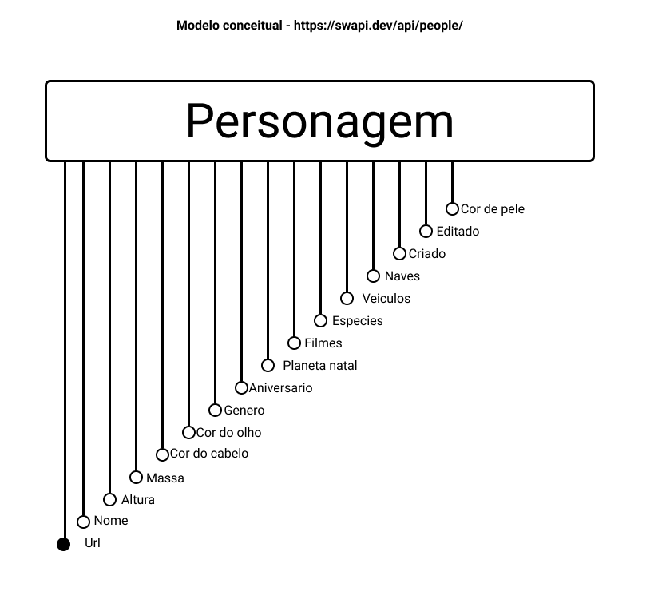

# Aluno
* Vitor Rodrigues Pietrobom - 245584

## `lab01`
  ### Tarefa 1
  > [notebook_file](lab01/notebook/lab01.ipynb)

  ### Tarefa 2
  > 

## `lab02`
  ### Tarefa 1 - 4
  > [notebook_file](lab02/lab2_logic_model_dbpedia.ipynb)

## `lab03`
  ### Tarefa 1 - 3
  > [notebook_file](lab03/lab03-nhanes.ipynb)

## `lab04`
  ### Tarefa 1 - 2
  > [notebook_file](lab04/lab04-sql-advanced.ipynb)

## `lab05`
  ### Tarefa 1 - 2
  > [readme](lab05/readme.md)
