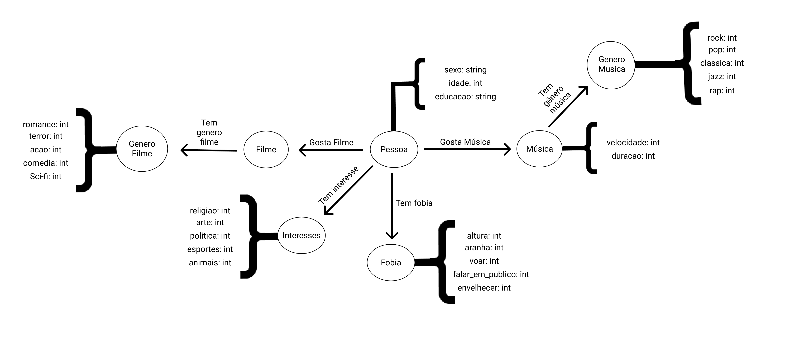

Apresentação do Lab07 - Modelo Lógico para Banco de Dados de Grafos

Estrutura de pastas:

~~~
├── README.md  <- arquivo apresentando a tarefa
│
└── images     <- arquivos de imagem usados na tarefa
~~~

# Aluno
* `RA`: `Vitor Pietrobom`

## Modelo Lógico do Banco de Dados de Grafos
> 

## Perguntas de Pesquisa/análise

> Liste aqui as três perguntas de pesquisa/análise
> * As fobias influenciam no gosto musical?
> * Como os interesses da pessoa influencia o gosto musical dela?
> * A escolaridade tem influência no gosto musical?
