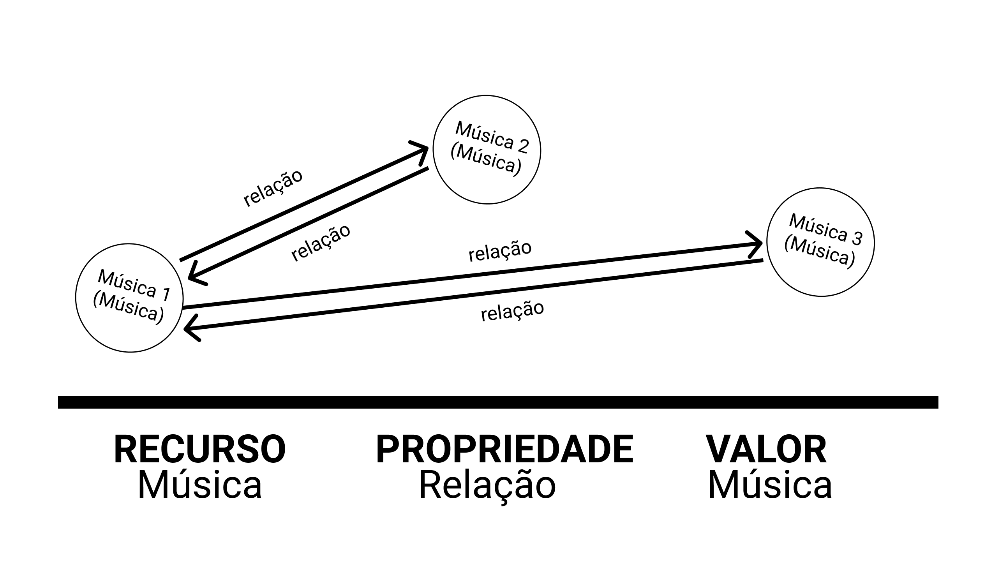
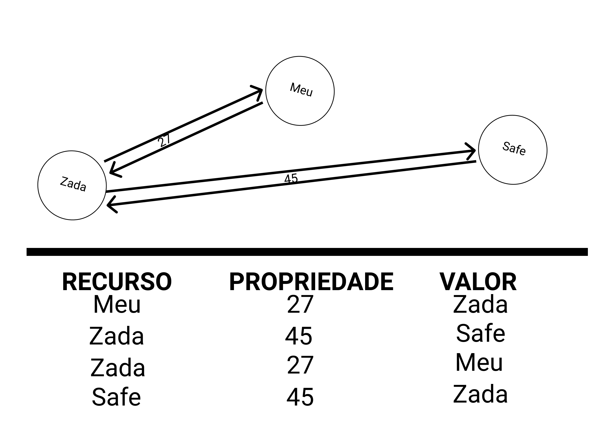

# Lab09 - Grafo de Conhecimento

Estrutura de pastas:

~~~
├── README.md  <- arquivo apresentando a tarefa
│
└── images     <- arquivos de imagem usados na tarefa
~~~

# Aluno
* `245584`: `<Vitor Rodrigues Pietrobom>`

## Exemplo de Grafo de Conhecimento - para publicar ou enriquecer
>
> 
>
> 

## Perguntas de Pesquisa ou Queries

> Liste aqui as três perguntas de pesquisa ou queries
> * Quão semelhantes 2 músicas são?
> * Existe algum gênero musical que tem maior probabilidade de se relacionar com outros gêneros musicais?
> * Qual é a música que se relaciona com o maior número de músicas?
